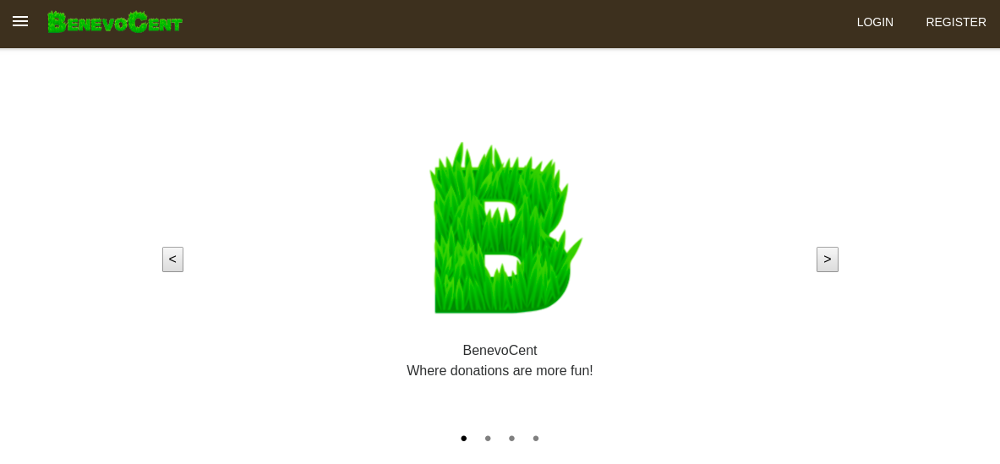
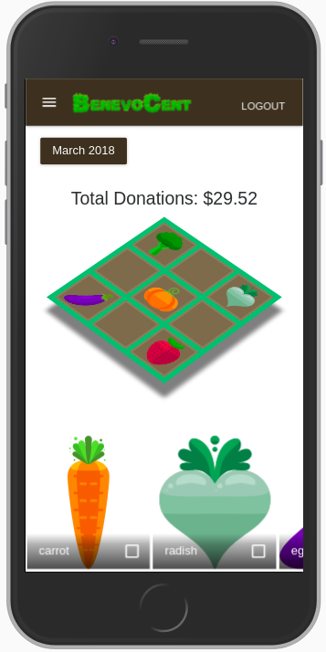
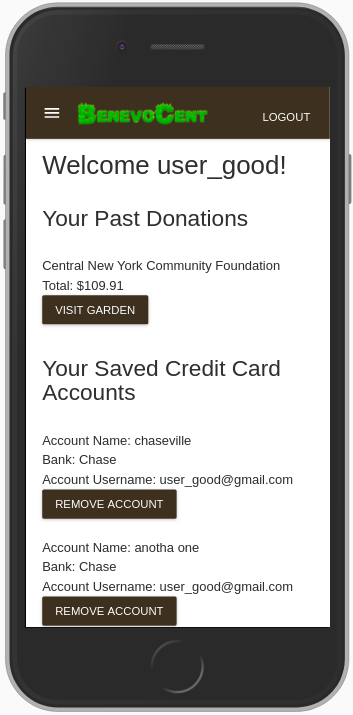
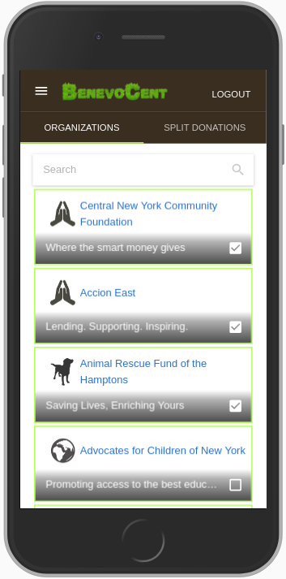
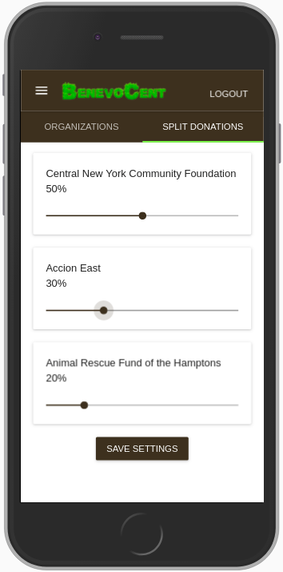
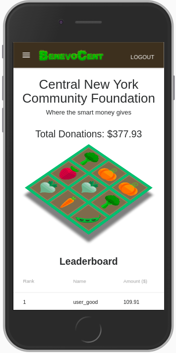

BenevoCent is a mobile-first progressive web app that simplifies and gamifies charitable giving. Based off of Acorns, it rounds up linked credit cards' transactions to the nearest dollar and automatically donates the difference to charities of your choice.



[Visit the Deployed Site](https://www.benevocent.com) or run it locally by downloading, running ```npm install```,  ```npm start```

To see the site from the perspective of a user with existing donations, use the following credentials:

email: user_good@gmail.com
password: 123123










